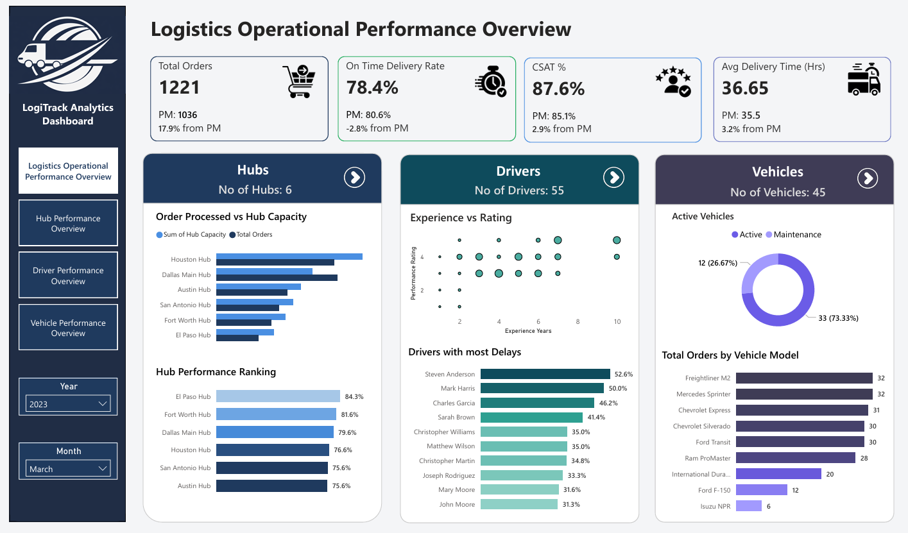
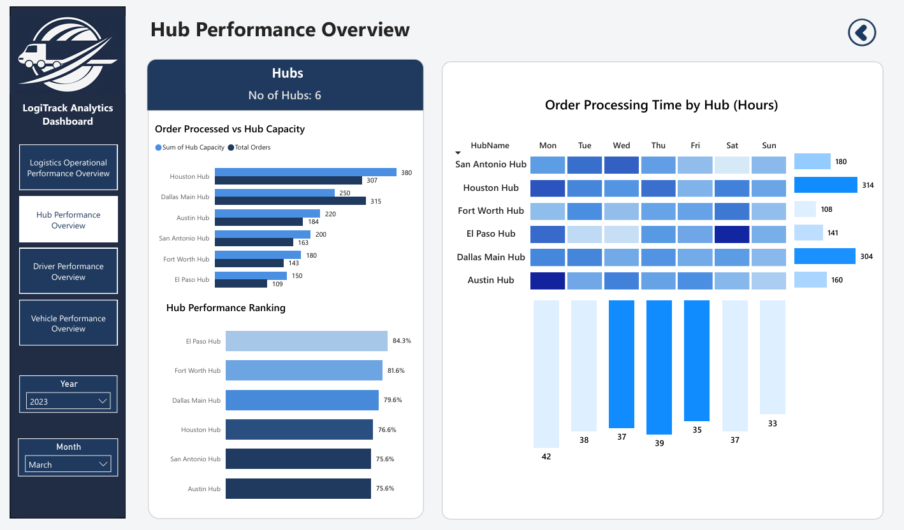
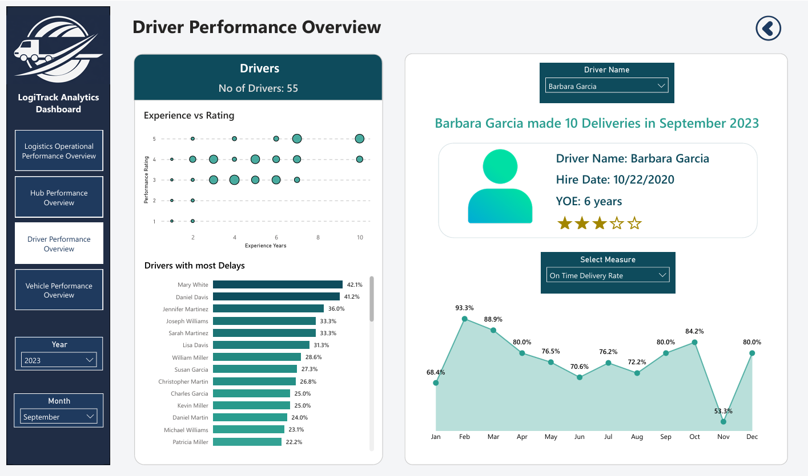
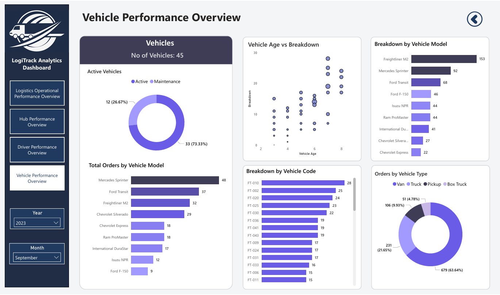

# LogiTrack Analytics Dashboard

## Project Objective
This project presents a comprehensive Power BI dashboard designed to analyze logistics operational bottlenecks and delays across hubs, drivers, and vehicles. The dashboard provides insights into delivery performance, operational efficiency, and customer satisfaction.

## Data Source
- **Orders**: Delivery details, delays, customer satisfaction, delivery time  
- **Hubs**: Hub capacity and processing information  
- **Drivers**: Experience, ratings, and performance metrics  
- **Vehicles**: Fleet details, breakdowns, and maintenance  

## Dashboard Features

### 🔹 1. Overview Dashboard
- KPI summary (Orders, On-Time %, CSAT, Delivery Time)
- Orders processed vs hub capacity
- Hub performance ranking
- Driver performance insights
- Vehicle utilization overview

---

### 🔹 2. Hub Performance Dashboard
- Total number of hubs
- Orders vs capacity analysis
- Hub performance ranking
- Order processing time (daily heatmap)

---

### 🔹 3. Driver Performance Dashboard
- Total number of drivers
- Experience vs performance rating (scatter plot)
- Drivers with highest delays
- Individual driver profile (Hire Date, YOE, Rating, Deliveries)
- Monthly delivery trends

---

### 🔹 4. Vehicle Performance Dashboard
- Total fleet size
- Active vs maintenance vehicles
- Orders by vehicle model
- Vehicle breakdown analysis
- Vehicle age vs breakdown (reliability analysis)
- Orders distribution by vehicle type

## Key Insights
- Identified top-performing and underperforming hubs based on efficiency  
- Analyzed driver performance vs experience to highlight skill gaps  
- Detected vehicle models with higher breakdown rates  
- Highlighted peak processing delays across hubs and days  
- Monitored trends in delivery performance and customer satisfaction  

## Tools & Technologies
- Power BI  
- DAX (Data Analysis Expressions)  
- Data Modeling  
- Data Visualization  

## Dashboard Preview

### Overview Dashboard

### Hub Performance

### Driver Performance

### Vehicle Performance

